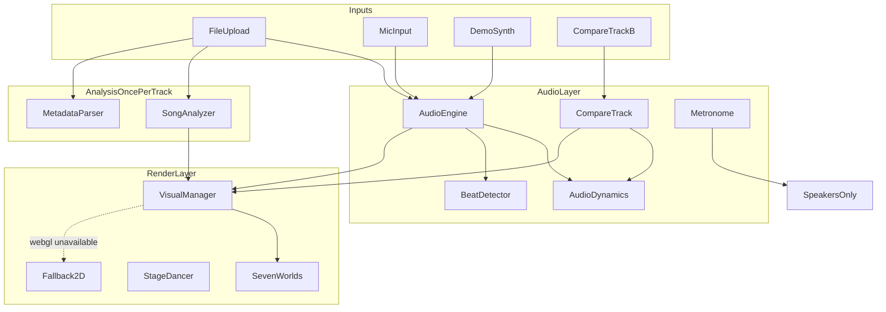

# Vartan — Project Spec (source of truth)

This document is the permanent reference for humans and AI working on Vartan.
If a proposed change conflicts with this file, the change is wrong — or this
file must be consciously updated first.

## 1. Purpose

Vartan is a free, browser-only music visualizer built for a music classroom
(TUMO-style setting). A teacher or student opens a link, drops a song (or uses
the mic), and full-screen visuals react live to the music. It must be
demonstrable in front of a class with **zero risk of API failures, rate
limits, logins, or installs**.

## 2. Hard constraints (never violate)

- **No API keys, no accounts, no backend, no database.** The app is static files.
- **No live AI generation** (image/video/LLM). Nothing in the critical path
  may call a rate-limited service.
- The only network call allowed is the **iTunes Search API** for cover art,
  and it must **fail silently** (never an error UI, never blocks anything).
  (Cover-art helpers may still exist in the repo; they are not on the critical
  live path for the current UI.)
- Must work **offline after first load** for everything except optional iTunes art.
- Must run from a **GitHub Pages project site** (see `vite.config.ts` base).
- Audio never leaves the device. Mic input is never recorded or uploaded.
- No login walls, no analytics, no cookies.
- **No YouTube / remote URL → MP3 conversion** in-app (static hosting + ToS).
- **No settings persistence** for now (options are session-only; no localStorage).

## 3. Explicitly out of scope (do not add)

- Gemini / OpenRouter / Hugging Face / Replicate integrations
- "Generate with AI" buttons of any kind
- Screen-capture audio (Chromium-only, flaky)
- Chrome extension packaging
- Accounts, saved projects, cloud sync
- Bloated settings with dozens of unrelated sliders

**Allowed:** a single **focused Options drawer** (accordion sections) for
musician tools — Track info, Display, Practice, Compare. Keep the live canvas
chrome minimal; put power features behind the gear (`O`).

## 4. Architecture



Data flow every frame (60fps):
`AudioEngine.getFrame()` → `AudioDynamics` (AGC + hits + section) →
`BeatDetector` → `VisualParams` (+ intensity scales) → active world `update()` →
render. When Compare split is on, `CompareTrack.getFrame()` drives the right half
via `VisualManager.renderSplit` (scissor + dual spectrum/history lanes).

Data flow once per file:
decode → `analyzeBuffer()` → `SongFingerprint` → `deriveStyle()` (palette + speed).
BPM is shown in the UI (pill + Track info). World selection is **manual** via chips
(default **Stage**). Stage is an isolated spectacle world (3D dancer); other worlds
remain abstract shaders and must keep working unchanged.

## 5. Module map

| Path | Responsibility |
|---|---|
| `src/main.ts` | Entry: instantiate `App` |
| `src/app.ts` | Orchestrator: state, Options drawer, rAF loop, A–B loop, compare wiring |
| `src/audio/AudioEngine.ts` | AudioContext, analyser chain, file/mic playback, monitor + record gains |
| `src/audio/CompareTrack.ts` | Second file player + analyser for A\|B compare; Hear A/B/Mix |
| `src/audio/Metronome.ts` | Scheduled clicks from BPM (destination only — not analyser) |
| `src/audio/BeatDetector.ts` | Bass-onset beat envelope (0..1 decaying) |
| `src/audio/AudioDynamics.ts` | AGC bands, hits, liveEnergy, sectionPulse, hueShift |
| `src/audio/DemoSynth.ts` | Procedural 120 BPM demo beat |
| `src/audio/types.ts` | `AudioFrameMetrics`, `SongFingerprint`, defaults |
| `src/analysis/SongAnalyzer.ts` | Offline BPM/energy/bassRatio/brightness |
| `src/analysis/fingerprint.ts` | Fingerprint → palette (`deriveStyle`) |
| `src/visuals/VisualManager.ts` | Renderer, dual texture lanes, world registry, split scissor render |
| `src/visuals/VisualParams.ts` | `VisualParams`, intensity scales, world IDs/labels, uniforms |
| `src/visuals/VisualWorld.ts` | Base class + fullscreen-triangle helper |
| `src/visuals/stage/MoodPacks.ts` | Fingerprint → sway/groove/bounce/stomp pack |
| `src/visuals/stage/DanceConductor.ts` | BPM timeScale + beat accents for Stage |
| `src/visuals/stage/createDancer.ts` | Procedural hooded dancer + AnimationClips |
| `src/visuals/glsl.ts` | Shared GLSL noise/uniform chunks |
| `src/visuals/worlds/*.ts` | The seven shipped worlds (see below) |
| `src/visuals/Fallback2D.ts` | Canvas2D radial spectrum when WebGL fails |
| `src/metadata/*` | ID3 / iTunes / poster helpers (optional; not required for live UI) |
| `src/export/snapshot.ts` | PNG download of current frame |
| `src/export/recorder.ts` | MediaRecorder canvas+audio clips, 30s hard cap |
| `src/ui/styles.css` | Styling including drawer, meters, split labels |

## 6. Core contracts

```ts
interface AudioFrameMetrics {
  bass: number;
  mid: number;
  treble: number;
  volume: number;
  beat: number;
  spectrum: Uint8Array;
}

interface SongFingerprint {
  bpm: number;             // 60..190
  energy: number;          // 0..1
  bassRatio: number;       // 0..1
  brightness: number;      // 0..1
  beatRegularity: number;  // 0..1
  genreHint?: string;
}

interface VisualParams {
  time, dt,
  bass, mid, treble, volume, beat,
  bassHit, midHit, trebleHit,
  liveEnergy, sectionPulse, liveSpeed,
  energy, brightness, speed,
  bpm, bassRatio, genreHint?,
  colorA, colorB, colorC,
  displaceScale,   // from view intensity
  cameraPull       // from view intensity
}

type ViewIntensity = 'calm' | 'normal' | 'intense';
// calm:   displace 0.55, cameraPull 0.25
// normal: 1.0 / 1.0
// intense: 1.25 / 1.15
```

Shared uniforms include `uDisplaceScale`. Flow + Terrain apply displace in the
vertex shader and scale camera approach with `cameraPull`.

Spectrum textures: 64×1 `RedFormat`; history: 64×64 scrolling (`uHistory` +
`uHistRow`). Compare uses a second lane for Track B.

## 7. Visual worlds

| ID | Label | Type | Key audio drivers |
|---|---|---|---|
| `stage` | Stage | 3D dancer (default) | mood pack, BPM timeScale, beat accents, lights |
| `flow` | Flow | Terrain + sky | spectrum history peaks, bass camera, hits |
| `aurora` | Aurora | Fullscreen shader | bass bloom, treble shimmer |
| `particles` | Galaxy | Point cloud | beat impulse, treble size |
| `kaleidoscope` | Prism | Radial fold shader | mid segments, beat zoom |
| `waves` | Terrain | History plane | bass peaks, beat ripple |
| `tunnel` | Neon | Polar fly shader | speed, bass rings, spectrum |

`AlbumWorld` may still exist as unused code; it is **not** in `WORLD_IDS`.

**Stage** is isolated: Mixamo dancer (dark stage styling) with real dance clips.
Mood packs auto-picked from fingerprint and can shift mid-song from live energy /
section pulses / hits — no user style menu. Accents fire on beats. Procedural
hooded figure is fallback if assets fail. See `public/stage/README.md`.

Rules for worlds:
- Bass hits must be *felt* (pulse/bloom/shake), not just wiggle.
- Every world consumes the palette so different songs look different.
- New worlds: extend `VisualWorld`, register in `VisualManager.createWorld`,
  add ID to `WORLD_IDS`/`WORLD_LABELS`.
- Do not fold the dancer into shader worlds — Stage stays its own thing.

## 8. Palette (fingerprint.ts)

- Hue: dark tracks (brightness < 0.45) → violet/indigo; bright → cyan→amber.
- Saturation scales with energy; accent color is the complement.
- Speed = 0.5 + bpmNorm * 0.9 + energy * 0.4 (range ~0.5..1.8).
- Live colors also shift via `deriveLiveColors` (hue drift, hits, sections).
- World pick is **manual** (chips). Default world: `stage`.

## 9. UI spec

States: **hero** (drop/mic/demo) → **live** (canvas + controls). Controls
auto-fade after 3.5s idle; pointer/touch wakes them.

**Options drawer** (gear / `O`, Esc / backdrop closes):
- Track info: BPM, energy, bass, brightness, tap-tempo
- Display: intensity, meters, Clean UI (floating gear remains)
- Practice: A–B loop, metronome, tap tempo
- Compare (file only): load Track B, Split view, Hear A/B/Mix

BPM pill in the top bar (file/demo) opens Track info.

Exact user-facing copy for failure states:
- Mic denied: `Microphone blocked — drop an audio file instead.`
- Bad audio file: `Couldn't read that file — try an MP3, WAV, or M4A.`
- Recording unsupported: `Recording isn't supported in this browser.`

Keyboard: Space = play/pause, O = options, Esc = close drawer, F = fullscreen,
S = snapshot.

Never show raw errors, stack traces, or HTTP status codes to the user.

Audio unlock: all sources start from user gestures; if the context is still
suspended, a full-screen `Tap to start` overlay appears.

## 10. Compare (A|B split)

- Track A = `AudioEngine` (file). Track B = `CompareTrack` sharing the same
  `AudioContext`.
- Split: `VisualManager.renderSplit` with scissor/viewport halves; same world
  on both sides; CSS divider + A/B labels.
- **Stage exception:** while Split is on and the active world is Stage, the canvas
  stays full-bleed driven by **Track A** only (single dancer). Overlay label reads
  “Stage uses Track A”. Hear A/B/Mix and Track B loading remain unchanged.
  Switching to a shader world restores true A|B scissor split.
- Hear modes duck Track A monitor/record gain and Track B gain
  (A / B / Mix ≈ 0.55).
- Play/pause/seek sync both clocks. Disabled for mic/demo.
- Snapshot/record still use the single canvas (+ audio record tap).

## 11. Analysis implementation note

Dependency-free DSP (`SongAnalyzer.ts`): OfflineAudioContext band-filter
renders + onset autocorrelation. 10s timeout → `DEFAULT_FINGERPRINT`.

## 12. Build & deploy

- `npm run dev` → Vite dev server
- `npm run build` → `tsc` + Vite → `dist/`
- Deploy: push to `main` → GitHub Pages workflow / `gh-pages` (see README)
- `vite.config.ts` uses relative `base` for project Pages sites

## 13. Testing checklist (run before sharing the link)

- [ ] Stage default on load: hooded dancer grooves; lights react to bass/beat
- [ ] Ballad vs banger on Stage → different pack / intensity / hit timing
- [ ] Stage ↔ Flow mid-song: no WebGL errors; audio continues
- [ ] Slow ballad → calm motion, muted palette (shader worlds)
- [ ] Bass-heavy track → Flow Intense zooms; **Calm** pulls camera back / lowers peaks
- [ ] BPM pill matches analysis; Track info labels update
- [ ] Meters toggle; Clean UI hides chrome; floating gear still opens Options
- [ ] A–B loop wraps during play; Clear restores normal seek
- [ ] Metronome clicks while playing; tap tempo updates Track info + metro
- [ ] Compare: load B → Split → left=A right=B on Flow; Hear A/B/Mix; eject clears B
- [ ] Compare on Stage: full-bleed dancer + “Stage uses Track A” hint; Hear still works
- [ ] Compare disabled / hinted on mic and demo
- [ ] All seven worlds switchable live during playback
- [ ] Mic works; denying mic shows the friendly hint
- [ ] Demo beat works with no file and no mic
- [ ] Snapshot downloads a PNG; Record stops at 30s and downloads
- [ ] Fullscreen + controls auto-fade
- [ ] iPad/Safari: tap-to-start overlay unlocks audio
- [ ] `npm run build` passes; site works at the project Pages path
