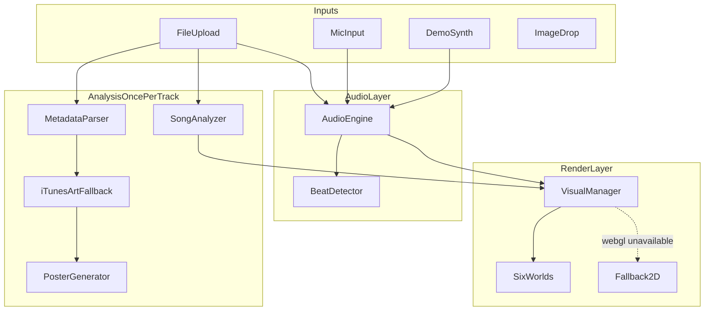

# Vartan — Project Spec (source of truth)

This document is the permanent reference for humans and AI working on Vartan.
If a proposed change conflicts with this file, the change is wrong — or this
file must be consciously updated first.

## 1. Purpose

Vartan is a free, browser-only music visualizer built for a music classroom
(TUMO-style setting). A teacher or student opens a link, drops a song (or uses
the mic), and full-screen visuals react live to the music. It must be
demonstrable in front of a class with **zero risk of API failures, rate
limits, logins, or installs**.

## 2. Hard constraints (never violate)

- **No API keys, no accounts, no backend, no database.** The app is static files.
- **No live AI generation** (image/video/LLM). Nothing in the critical path
  may call a rate-limited service.
- The only network call allowed is the **iTunes Search API** for cover art,
  and it must **fail silently** (never an error UI, never blocks anything).
- Must work **offline after first load** for everything except iTunes art.
- Must run from a **GitHub Pages project site**: all asset paths respect
  Vite `base: '/vartan/'` (see `vite.config.ts`).
- Audio never leaves the device. Mic input is never recorded or uploaded.
- No login walls, no analytics, no cookies.

## 3. Explicitly out of scope (do not add)

- Gemini / OpenRouter / Hugging Face / Replicate integrations
- "Generate with AI" buttons of any kind
- Screen-capture audio (Chromium-only, flaky)
- Chrome extension packaging
- Accounts, saved projects, cloud sync
- Settings panels with dozens of sliders — the UI stays minimal

## 4. Architecture



Data flow every frame (60fps):
`AudioEngine.getFrame()` → smoothed bass/mid/treble/volume + raw spectrum →
`BeatDetector.update()` → beat envelope → `VisualParams` → active world's
`update()` → render.

Data flow once per file:
decode → `analyzeBuffer()` (OfflineAudioContext DSP) → `SongFingerprint` →
`deriveStyle()` (palette + speed) + `matchWorld()` (auto style pick).

## 5. Module map

| Path | Responsibility |
|---|---|
| `src/main.ts` | Entry: instantiate `App` |
| `src/app.ts` | Orchestrator: state, UI wiring, rAF loop |
| `src/audio/AudioEngine.ts` | AudioContext, analyser chain, file/mic playback, record tap |
| `src/audio/BeatDetector.ts` | Bass-onset beat envelope (0..1 decaying) |
| `src/audio/DemoSynth.ts` | Procedural 120 BPM demo beat (no audio files needed) |
| `src/audio/types.ts` | `AudioFrameMetrics`, `SongFingerprint`, defaults |
| `src/analysis/SongAnalyzer.ts` | Offline BPM/energy/bassRatio/brightness via OfflineAudioContext |
| `src/analysis/fingerprint.ts` | Fingerprint → palette (`deriveStyle`) + world pick (`matchWorld`) |
| `src/visuals/VisualManager.ts` | Renderer, spectrum/history DataTextures, world registry |
| `src/visuals/VisualParams.ts` | `VisualParams`, world IDs/labels, shared uniform helpers |
| `src/visuals/VisualWorld.ts` | Base class + fullscreen-triangle helper |
| `src/visuals/glsl.ts` | Shared GLSL noise/uniform chunks |
| `src/visuals/worlds/*.ts` | The six worlds (see below) |
| `src/visuals/Fallback2D.ts` | Canvas2D radial spectrum when WebGL fails |
| `src/metadata/MetadataParser.ts` | ID3 via `music-metadata` (dynamic import, never throws) |
| `src/metadata/iTunesArt.ts` | iTunes Search cover fetch, resolves `null` on any failure |
| `src/metadata/poster.ts` | Palette-driven generated poster (canvas) |
| `src/export/snapshot.ts` | PNG download of current frame |
| `src/export/recorder.ts` | MediaRecorder canvas+audio clips, 30s hard cap |
| `src/ui/styles.css` | All styling; dark theme, CSS variables in `:root` |

## 6. Core contracts

```ts
// Per-frame (from AudioEngine.getFrame + BeatDetector)
interface AudioFrameMetrics {
  bass: number;      // 0..1, smoothed (fast attack, slow release)
  mid: number;
  treble: number;
  volume: number;
  beat: number;      // spike to 1 on beat, exp decay
  spectrum: Uint8Array;
}

// Once per file (SongAnalyzer). Mic/demo use DEFAULT_FINGERPRINT variants.
interface SongFingerprint {
  bpm: number;             // 60..190
  energy: number;          // 0..1
  bassRatio: number;       // 0..1 low-band share
  brightness: number;      // 0..1 high-band share
  beatRegularity: number;  // 0..1
  genreHint?: string;
}

// What every world receives every frame (VisualParams.ts)
interface VisualParams {
  time, dt,
  bass, mid, treble, volume, beat,   // live
  energy, brightness, speed,          // fingerprint-derived
  colorA, colorB, colorC              // THREE.Color palette
}
```

Shared shader uniforms (see `createSharedUniforms`): `uTime, uBass, uMid,
uTreble, uVolume, uBeat, uEnergy, uSpeed, uAspect, uColorA/B/C, uSpectrum`.
`uSpectrum` is a 64x1 `RedFormat` DataTexture; `WaveWorld` additionally uses
a 64x64 scrolling history texture (`uHistory` + `uHistRow`).

## 7. Visual worlds

| ID | Label | Type | Key audio drivers |
|---|---|---|---|
| `aurora` | Aurora | Fullscreen shader (fbm curtains) | bass → bloom, treble → shimmer/stars |
| `particles` | Galaxy | 6000-point shader cloud | beat → outward impulse, treble → size, bass → camera push |
| `kaleidoscope` | Prism | Fullscreen shader (radial fold) | mid → segments, beat → zoom, spectrum → radius rings |
| `waves` | Terrain | Displaced plane over history tex | bass → peak height, beat → center ripple |
| `tunnel` | Neon | Fullscreen shader (polar fly) | BPM/speed → fly rate, bass → ring pulse, spectrum → wall struts |
| `album` | Pulse | Art texture + warp shader | bass → zoom, beat → chromatic split, mid → warp |

Rules for worlds:
- Bass hits must be *felt* (pulse/bloom/shake), not just wiggle.
- Every world consumes the palette so different songs look different.
- New worlds: extend `VisualWorld`, register in `VisualManager.createWorld`,
  add ID to `WORLD_IDS`/`WORLD_LABELS`. Nothing else should need changes.

## 8. Palette + auto-match logic (fingerprint.ts)

- Hue: dark tracks (brightness < 0.45) → violet/indigo; bright → cyan→amber.
- Saturation scales with energy; accent color is the complement.
- Speed = 0.5 + bpmNorm * 0.9 + energy * 0.4 (range ~0.5..1.8).
- `matchWorld`: art present → `album`; low energy + slow → `aurora`;
  bassRatio > 0.52 → `waves`; fast + energetic → `tunnel`/`particles`
  (brightness splits); bright → `kaleidoscope`; default `particles`.
- Auto-match only applies while the user hasn't manually picked a world
  (`userPickedWorld` flag) and the Auto-match checkbox is on.

## 9. UI spec

States: **hero** (drop/mic/demo) → **live** (canvas + controls). Controls
auto-fade after 3.5s idle; pointer/touch wakes them.

Exact user-facing copy for failure states:
- Mic denied: `Microphone blocked — drop an audio file instead.`
- Bad audio file: `Couldn't read that file — try an MP3, WAV, or M4A.`
- Recording unsupported: `Recording isn't supported in this browser.`
- Image before song: `Load a song first, then drop artwork.`

Keyboard: Space = play/pause, F = fullscreen, S = snapshot.

Never show raw errors, stack traces, or HTTP status codes to the user.

Audio unlock: all sources start from user gestures; if the context is still
suspended, a full-screen `Tap to start` overlay appears (required by browser
autoplay policies, especially iOS Safari).

## 10. Artwork resolution order (Album Pulse)

1. Embedded ID3 picture (via `music-metadata` `parseBlob`)
2. iTunes Search API (`itunes.apple.com/search`, 6s timeout, silent fail;
   art URL upgraded `100x100` → `600x600`; images loaded `crossOrigin`
   anonymous — if CORS blocks texture use, we skip, we don't error)
3. Generated poster (`poster.ts`): palette gradient + track initial + title

An image file dropped by the user at any time overrides everything.

## 11. Analysis implementation note

The plan originally named essentia.js. The shipped implementation uses
**dependency-free DSP** instead (OfflineAudioContext band-filter renders +
onset autocorrelation in `SongAnalyzer.ts`): smaller bundle, no WASM loading,
same fingerprint fields, guarded by a 10s timeout falling back to
`DEFAULT_FINGERPRINT`. If BPM accuracy ever becomes a problem, essentia.js
can be swapped in behind `analyzeBuffer()` without touching anything else.

## 12. Build & deploy

- `npm run dev` → Vite dev server at `http://localhost:5173/`
- `npm run build` → `tsc` typecheck + Vite build to `dist/`
- Deploy: push to `main` → `.github/workflows/deploy.yml` builds and
  publishes to GitHub Pages (Settings → Pages → Source: **GitHub Actions**).
- URL: `https://<username>.github.io/vartan/`
- `vite.config.ts` uses `base: './'` (relative asset paths for GitHub Pages project sites).

## 13. Testing checklist (run before sharing the link)

- [ ] Slow ballad → slow drift, muted palette
- [ ] Bass-heavy EDM → strong pulses, fast motion, hotter palette
- [ ] Chaotic/live recording → no crash, irregular bursts
- [ ] All six worlds switchable live during playback
- [ ] Auto-match toggle changes the starting world per track
- [ ] MP3 with embedded art → Pulse shows real cover
- [ ] MP3 without art, known artist → iTunes art or silent poster fallback
- [ ] Manual image drop → Pulse mode with that image
- [ ] Mic works; denying mic shows the friendly hint
- [ ] Demo beat works with no file and no mic
- [ ] Snapshot downloads a PNG; Record stops at 30s and downloads
- [ ] Fullscreen + controls auto-fade
- [ ] iPad/Safari: tap-to-start overlay unlocks audio
- [ ] `npm run build` passes; site works at the `/vartan/` path
